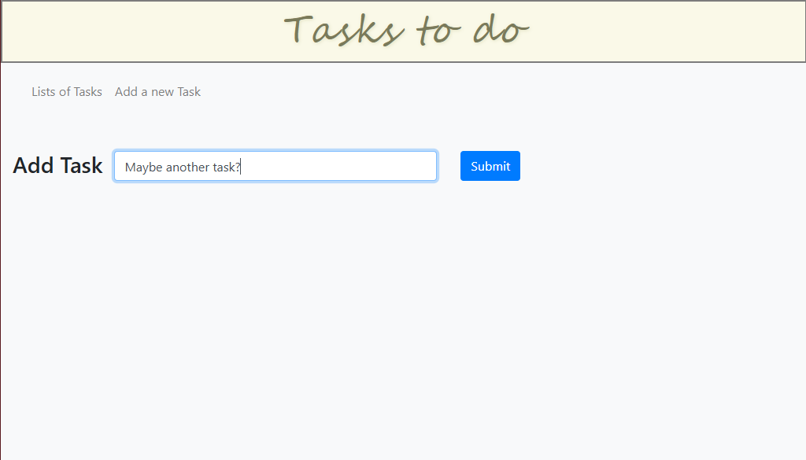
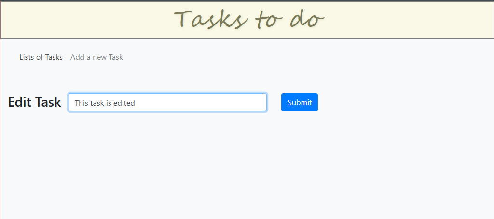
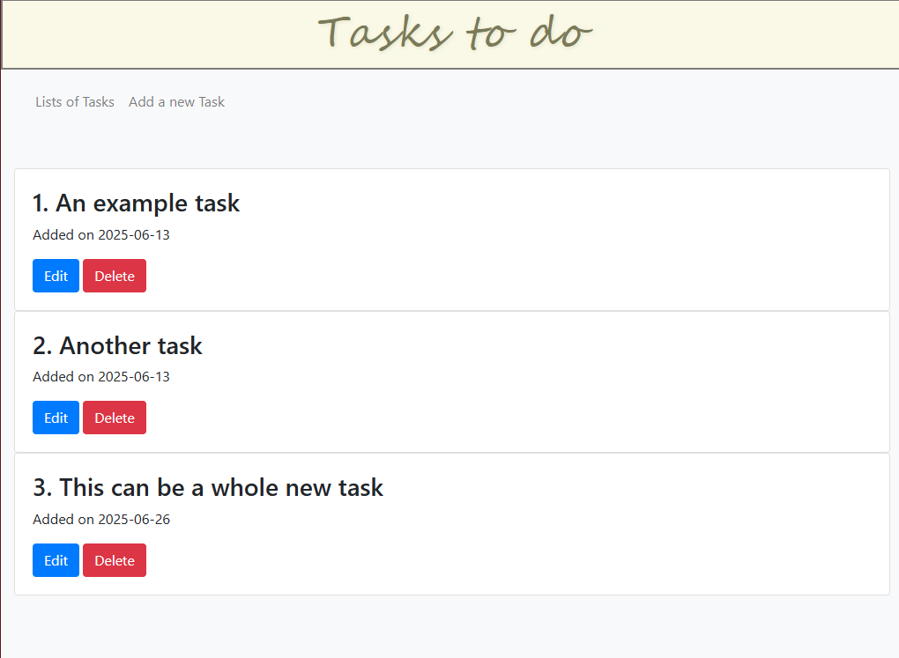

# ✅ Tasks-To-Do (Flask Web App)

A simple and functional To-Do List web application built with **Python (Flask)**. This app allows users to add, edit, and delete tasks, offering a basic task management system with a clean and minimal interface.

## 🔧 Features

- ➕ Add new to-do tasks  
- 📝 Edit existing tasks  
- ❌ Delete tasks  
- 🧠 In-memory data (no database required)  
- 💻 Lightweight Flask server with HTML templating

## 🛠 Tech Stack

- **Backend**: Python, Flask
- **Frontend**: HTML, Bootstrap (for basic styling)

## 🖼️ Demo screenshots:

 
 

## 🚀 Getting Started

### Prerequisites
- Python 3.x installed
- Flask (Install via pip: `pip install flask`)

### Running the App

```bash
git clone https://github.com/golamdastagir/Tasks-To-Do.git
cd Tasks-To-Do
python app.py
